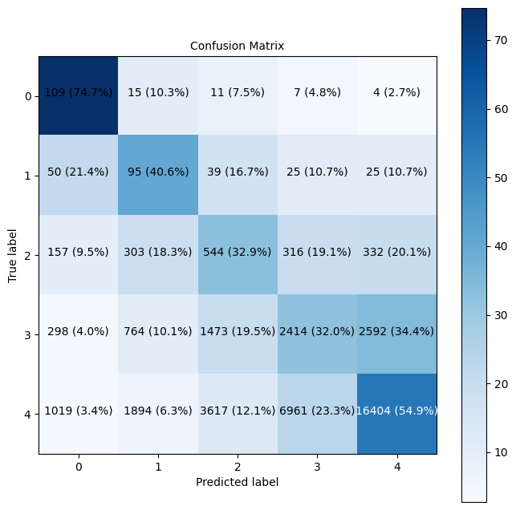
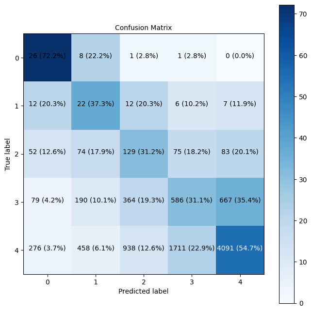

Predicting Crash Severity in Baton Rouge  
================================================

AUTHORS: Meysam Motaharfar and Mohammad Ali Izadifar

### Table of Contents
1. [Project Overview](#Project-Overview)
2. [Dataset Overview and Feature Dictionary](#Dataset-Overview-and-Feature-Dictionary)
3. [Data Preprocessing and Visulaization](#Data-Preprocessing-and-Visualization)
4. [Model Development](#Model-Development)
5. [Results and Conclusion](#results-and-conclusion)
6. [Challenges and Future Directions](#Challenges-and-Future-Directions)

## Project Overview

Traffic accidents remain a significant public safety challenge, necessitating predictive models to evaluate crash severity effectively. The primary goal of this project is to develop a predictive model that accurately assesses the severity of vehicle crashes. This study employs various machine learning techniques to predict crash severity based on multiple factors, including road conditions, vehicle conditions, traffic conditions, and driver attributes. The dataset, sourced from detailed traffic accident records, undergoes comprehensive exploratory data analysis to identify key predictors of crash severity. To address class imbalance in the data, techniques such as SMOTE (Synthetic Minority Oversampling Technique) and Random Over Sampling are implemented. A flexible and generalized pipeline was developed to automate data preprocessing and predictions, including the imputation of missing values, encoding the categorical features, samplers, and classifiers. The findings can be summarized as follows: 1) Logistic Regression emerged as a reliable baseline model due to its balanced performance and robustness in handling class imbalance, 2) Random Forests, as an ensemble method, showed promise, but required careful hyperparameter tuning to avoid overfitting, and 3) more complex models, like Multilayer Perceptrons, exhibited varying degrees of overfitting, indicating the need for further refinement. The developed model can serve as a crucial tool for policymakers, traffic management authorities, and public safety officials by enabling proactive interventions to improve road safety.

<b> Key Performance Indicator: </b>
The model's effectiveness is evaluated based on its recall performance, which measures the model's ability to correctly identify severe crashes from the total number of actual severe crashes. A high recall indicates that the model successfully captures most of the critical cases, ensuring fewer severe accidents are missed.

## Dataset Overview and Feature Dictionary

The dataset for this project was sourced from the Louisiana Department of Transportation and Development (LA DOTD), covering detailed records of traffic accidents from 2016 to 2021. Each record in the dataset provides comprehensive details about each traffic accident, including geographic coordinates, road conditions, vehicle characteristics, driver demographics, environmental factors, and the severity of the crash. The dataset contains approximately 49,336 records with 54 features, ensuring a rich basis for analysis. Among these 54 features 30 of them (24 categorical, 3 numerical, and 3 boolean) were selected for the purpose of this study. Here is the dictionary for data set: 

| Feature Name        | Description                                                    | Data Type   |
|---------------------|----------------------------------------------------------------|-------------|
| SEVERITY_CD         | The severity of crashes (fatal, severe, moderate, complaint and no injury)                             | Categorical |
| ROAD_COND_CD        | Road conditions at the time of the crash (e.g., bumps, holes)                      | Categorical |
| ROAD_TYPE_CD        | Type of road where the crash occurred (e.g., one way road, two-way road with a physical separation)                         | Categorical |
| SURF_COND_CD        | Surface condition of the road (e.g., dry, wet, ice)                               | Categorical |
| SURF_TYPE_CD        | Type of road surface (e.g., dirt, gravel, concrete)                                          | Categorical |
| PAVEMENT_TYPE       | Type of pavement on the road (gravel, graded, brick)                                  | Categorical |
| SHOULDER_TYPE_PRI   | Type of shoulder on the road                                   | Categorical |
| PRI_ROAD_TYPE       | Primary road type at the crash location (e.g, street, highway)                       | Categorical |
| ROAD_REL_CD         | Relation of crash to the road (e.g., shoulder, median)                 | Categorical |
| ALIGNMENT_CD        | Road alignment (e.g., straight, curve)                         | Categorical |
| ACCESS_CNTL_CD      | Type of access control at the crash location                   | Categorical |
| VEH_COND_CD         | Condition of the vehicle involved in the crash (defective break, defective headlights)                | Categorical |
| VEH_LIGHTING_CD     | Vehicle lighting condition during the crash                    | Categorical |
| VEH_TYPE_CD         | Type of vehicle involved in the crash (e.g., SUV, truck, school bus)                         | Categorical |
| DR_SEX              | Driver's sex                                                   | Categorical |
| LIGHTING_CD         | Lighting conditions during the crash (e.g, daylight, dark, dusk)                          | Categorical |
| WEATHER_CD          | Weather conditions at the time of the crash (e.g, clear, cloudy, rain, foggy)                  | Categorical |
| TRAFF_CNTL_CD       | Type of traffic control at the crash site (e.g., stop sign, yield sign, red signal on)                     | Categorical |
| TRAFF_CNTL_COND_CD  | Condition of the traffic control at the crash site             | Categorical |
| VIOLATIONS_CD       | Any traffic violations related to the crash (e.e., failure to yield, failure to signal)                    | Categorical |
| VISION_OBSCURE_CD   | Factors that obscured vision (e.g., rain, building, parked vehicles)            | Categorical |
| ACCESS_CNTL_CD      | Access control at the location of the crash                    | Categorical |
| MAN_COLL_CD         | Manner of collision (e.g., head-on, rear-end)                  | Categorical |
| DR_AGE              | Age of the driver involved in the crash                        | Numerical   |
| LATITUDE            | Latitude of the crash location                                 | Numerical   |
| LONGITUDE           | Longitude of the crash location                                | Numerical   |
| PEDESTRIAN          | Whether pedestrians were involved                              | Boolean     |
| INTERSECTION        | Whether the crash occurred at an intersection                  | Boolean |
| ALCOHOL             | Whether alcohol was involved                                   | Boolean     |
| DRUGS               | Whether drugs were involved                                    | Boolean     |

## Data Preprocessing and Visulaization

In this study, comprehensive data preprocessing and visualization were employed to prepare the traffic accident dataset for predictive modeling. The preprocessing pipeline automated key steps, including handling missing values, encoding categorical features, and addressing class imbalance using SMOTE and Random Oversampling. Exploratory Data Analysis (EDA) was conducted to visualize the spatial and temporal patterns of accidents, identify correlations between crash severity and key predictors such as road and traffic conditions, and highlight imbalances in class distributions. Below is the distribution of traffic accidents based on the severity condition

where the severity categories include No Injury, Complaint (non-serious injury), Moderate injury, Severe injury, and Fatal injury. As it is obvious from this chart, the data set is highly imbalanced and sampling method have to be employed to be able to build a reliable classifier. The following figure illustrates the spatial distribution of fatal accidents in Baton Rouge

from whihc it is evident that the majority of fatal accidents occur on highways, which is expected given the combination of high speeds and reduced reaction times, increasing the likelihood of severe outcomes. For more details please read the [report](Report.pdf) and for codes see this [notebook](https://github.com/meysam-motaharfar/Crash-Severity-Prediction/blob/main/Codes/Data%20Preprocessing%20and%20Data%20Visualization.ipynb) .

## Model Development 

For this project, various machine learning models were employed to predict crash severity, each offering unique strengths and considerations. Logistic Regression was used as a baseline model due to its simplicity, interpretability, and balanced performance on imbalanced data. Random Forests, an ensemble learning method, demonstrated strong predictive capabilities but required careful hyperparameter tuning to prevent overfitting. Additionally, more complex models like Multilayer Perceptrons (MLPs) were explored, though their susceptibility to overfitting highlighted the need for further optimization. The performance of these models was primarily evaluated using recall, emphasizing the accurate identification of severe crashes

## Results and Conclusion

The predictive modeling efforts yielded insightful results regarding crash severity. Logistic Regression emerged as a robust baseline model, offering balanced performance and effective handling of class imbalance, with moderate recall scores. Random Forests exhibited strong predictive capabilities, outperforming Logistic Regression in some cases, though the risk of overfitting necessitated careful hyperparameter tuning. Multilayer Perceptrons (MLPs) demonstrated the potential for higher accuracy but faced challenges with overfitting, suggesting the need for more extensive regularization and parameter optimization. Overall, the models highlighted critical features influencing crash severity, such as road conditions, traffic density, and vehicle attributes. Here is the performance of Logistic Regression model for training and test data set:

    

    

and the following chart illustrates the performance of all models used in this project on test data set:

    

For more details please read the [report](Report.pdf) and for codes see this [notebook](https://github.com/meysam-motaharfar/Crash-Severity-Prediction/blob/main/Codes/Crash%20Severity%20Model.ipynb) .
  
## Challenges and Future Directions

